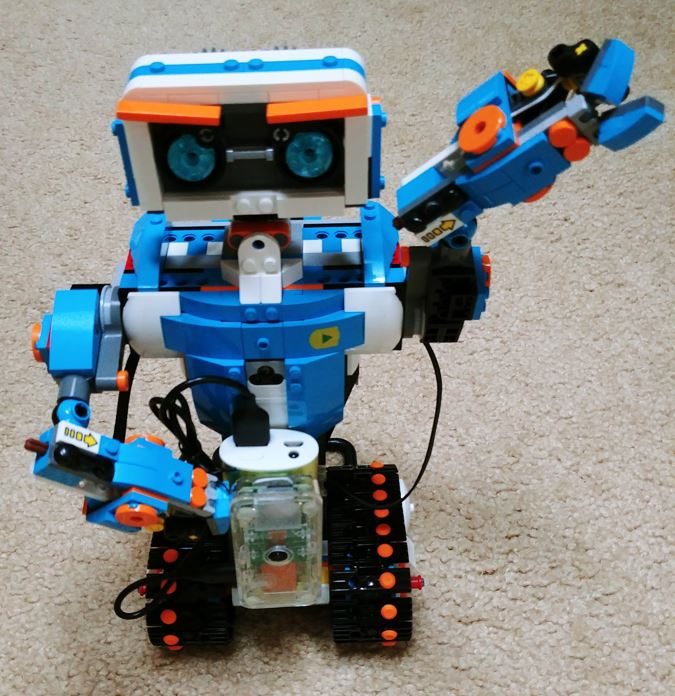

# Overview
IotDevicesPy is a Python lib for controlling IOT devices that contains following packages.
* IotLib - base classes for general IOT components and devices
* LegoLib - classes wrapping Lego MoveHub and components
* CameraLib - encapsulates cameras (Pi and OpenCV) used for video streaming and face tracking

# Getting Started
1. download/clone the respository. These steps assume that the code is under /home/pi/IotDevicesPy.
2. Install dependencies. 
   * without video streaming
       * LegoLib: pylgbst (see https://github.com/undera/pylgbst for more dependencies)
   * with video streaming and face tracking on Raspberry Pi
       * CameraLib: python3-opencv, dlib, picamera (opencv depends on numpy, libatlas-base-dev)
       * examples: flask
   * with video streaming and face tracking on Windows
       * python-opencv, dlib (see Notes below)
       * pip install Flask
3. Install the IotDevices packages.
    * Raspberry Pi
```
        cd IotDevicesPy
        sudo pip3 install .
```
    * Windows
```
        cd IotDevicesPy
        pip install .
```
4. Run samples under examples folder. See Examples section for details. Note that 'sudo' is needed to run in Raspberry Pi.

# Details
## IotLib
Python base classes to support IOT devices. 
* IotNode - the base class for all IOT nodes
* IotMotor - the base class for motors
* IotEncodedMotor - base class for encoded motors
* IotDistanceSensor - base class for sensor measuring distance
* IotMobileBot - base class that implements main functions for a mobile bot 

## CameraLib
Classes to support camera and face tracking.

## LegoLib
Classes to control Boost componnts. LegoLib extends the classes defined in IotLib.
* LegoMoveHub - connect to Move Hub and sending commands
* LegoMotor - implements controls to lego motor
* BoostBot - implements controls to a Boost bot (like Vernie)
* BoostCommandBot - extends BoostBot to support using text command

# Examples
Sample codes are provided under the examples folder. Also see https://github.com/rphuang/LegoBoostCmdPy for more usages. Note that 'sudo' is needed to run in Raspberry Pi.
* legoBoostSample-auto.py - simple code to run Boost in auto modes (follow, wander)
* legoBoostSample-bot.py - simple code to run Boost using BoostBot class
* legoBoostSample-cmd.py - simple code to run Boost using BoostCommandBot class
* legoBoostSample-stream.py - simple code to run Boost along with video streaming from a Pi Zero W as in this picture. Note that the resolution is 320x240 due to Pi Zero limitation.

* streamingService.py - sample video streaming service using flask
* streamSample-pi.py - simple code to stream on RasPi
* streamSample-win.py - simple code to stream on Windows

# Notes, Issues
* MoveHub automatically switch off a lot immediately after connected on Raspberry Pi Zero (for both pygatt and bluepy). However, that never happened for Windows and Raspberry Pi 4.
* Blue tooth package used for testing
    * Windows: bleak
    * Raspberry Pi: pygatt
* install opencv on Windows with Visual Studio Community 2022 and Python 3.10
    1. install "Desktop development with C++" in Visual Studio
    2. install cmake: pip install CMake
    3. download dlib from https://github.com/davisking/dlib and unzip
    4. build & install dlib from the unzipped folder: py setup.py install
    5. install numpy & opencv: pip install numpy opencv-python
* Maybe it's better to replace Vernie's head with Raspberry Pi 4 for better stability and performance.

# ToDos
* RasPi components and devides
* Kasa smart plug
* Tello drone
* Leverage Android phone's sensors

